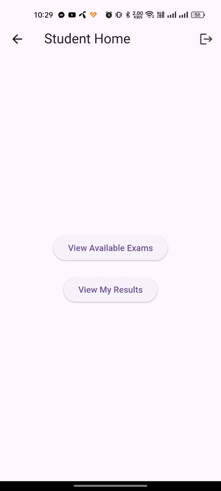

# 📘 TestZen User Manual

* Version: 1.0
* Platform: Android
* Technology Stack: Flutter + Firebase
* Developer: Tanzirul Islam (ID: 2203054, 22 Series, Dept. of CSE, RUET)
* Project Supervisor: Nahin Ul Sadad, Assistant Professor, Dept. of CSE, RUET

---

## 🔰 Introduction

**TestZen** is a mobile exam platform where teachers can create real-time MCQ tests, and students can take exams with a live countdown timer. The app ensures fairness by auto-submitting exams when time runs out and supports result tracking for both parties.

---

## 🧑‍💻 Getting Started

### Step 1: Launch the App

Once installed, open the app on your Android device. You’ll be asked to **select your role**:

* 👨‍🏫 **Admin (Teacher)**
* 👩‍🎓 **Student**

---

## 👨‍🏫 Admin (Teacher) Features

### ✅ 1. Register / Login

* Choose **Admin**
* Enter email and password to log in or register

  
    

---

### 🏠 2. Admin Home

After logging in, you'll be directed to the **Admin Dashboard** with options to:

* Create a new exam
* View/edit existing exams
* Add questions
* Review past results

---

### 📝 3. Create Exam

1. Tap on **"Create Exam"**
2. Enter:

    * Exam Title
    * Date & Time
    * Duration (in minutes)
3. Tap **Submit**

---

### ❓ 4. Add Questions

1. After creating the exam, go to **"Add Question"**
2. Enter:

    * Question Text
    * Four options
    * Select the correct answer
3. Tap **Save**

---

### 📋 5. Exam List

* View all created exams
* Edit/delete existing ones if needed

---

## 👩‍🎓 Student Features

### ✅ 1. Register / Login

* Choose **Student**
* Enter email and password to log in or register

  
  

---

### 🏠 2. Student Home

* View available exams
* See the list of previous results

---

### 📅 3. Available Exams

* See a list of all available exams

 

---

### 🧪 4. Exam Screen

* Answer each MCQ
* Countdown timer is visible
* If you join late, time is adjusted automatically
* Tap **Submit** (or it will auto-submit when time ends)

---

### ⏳ 5. Waiting Screen for Result

* Once submitted, the result will be displayed after the exam ends.

---
### 🧾 6. View Results

* Go to **Results** tab
* View scores 
* Access to the previous exam results

  
  

---

## 🧠 Summary of Key Features

| Feature               | Admin       | Student         |
| --------------------- | ----------- | --------------- |
| Register/Login        | ✅           | ✅               |
| Create Exams          | ✅           | ❌               |
| Add Questions         | ✅           | ❌               |
| Join Exams            | ❌           | ✅               |
| Real-Time Timer       | ✅ (view)    | ✅ (use)         |
| Late Join Adjustments | ✅           | ✅               |
| Auto Submission       | ✅ (enabled) | ✅ (experienced) |
| View Results          | ✅           | ✅               |

---

## 📫 Support

**Developer:** Tanzirul Islam (ID: 2203054, 22 Series, Dept. of CSE, RUET)
* 📧 Email: [tanzirul.islam56@gmail.com](mailto:tanzirul.islam56@gmail.com)
* 🔗 GitHub: [TanzirulIslam22](https://github.com/TanzirulIslam22)

